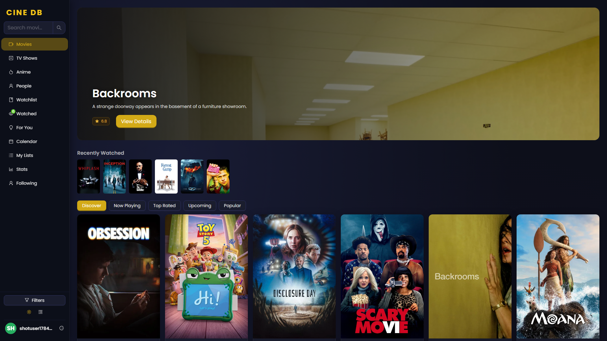
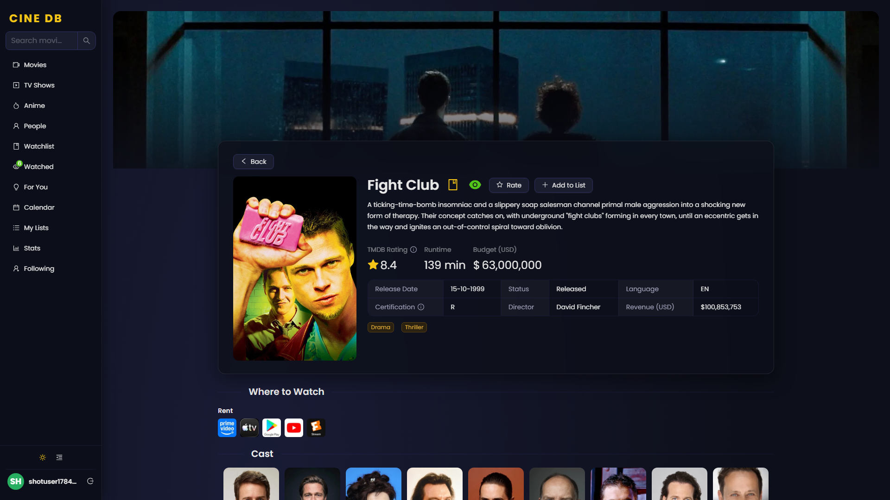
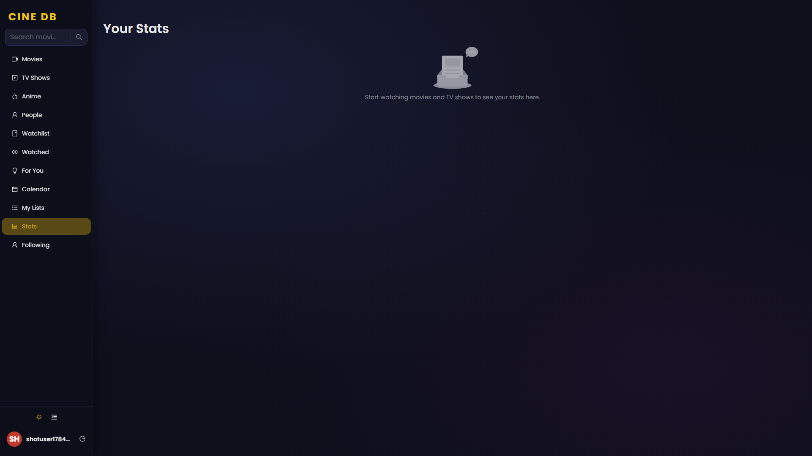
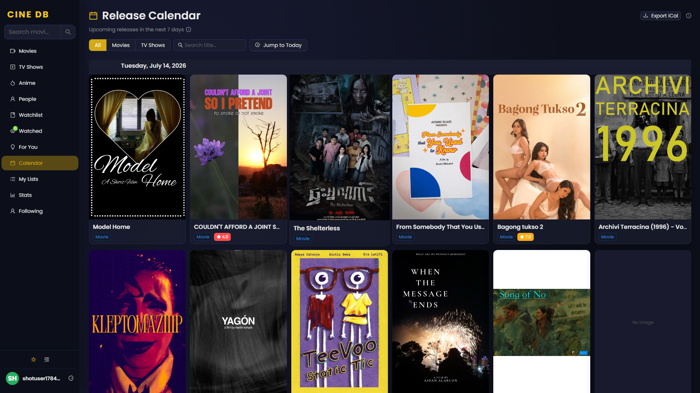
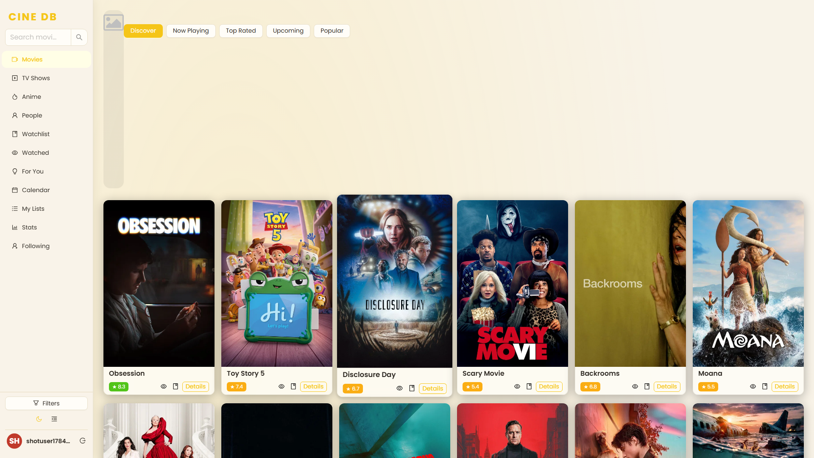
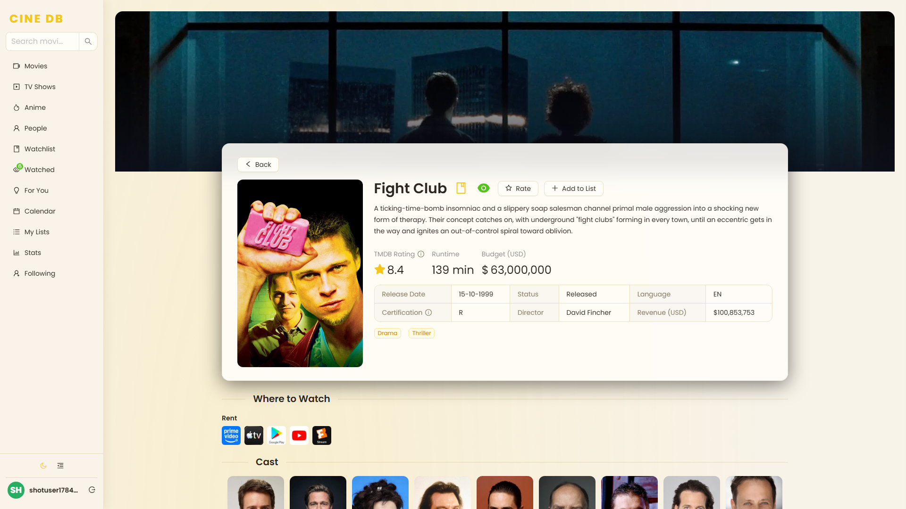
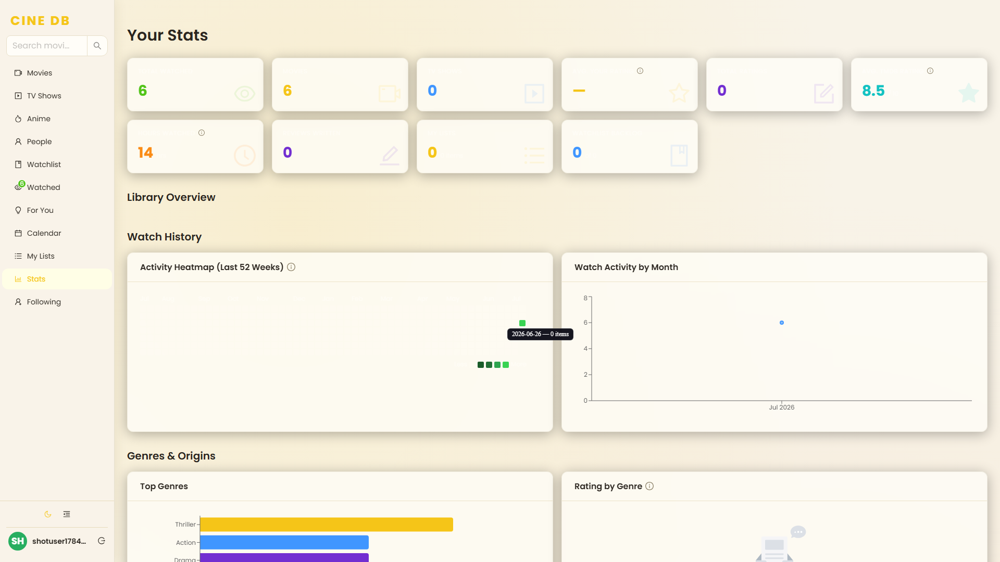
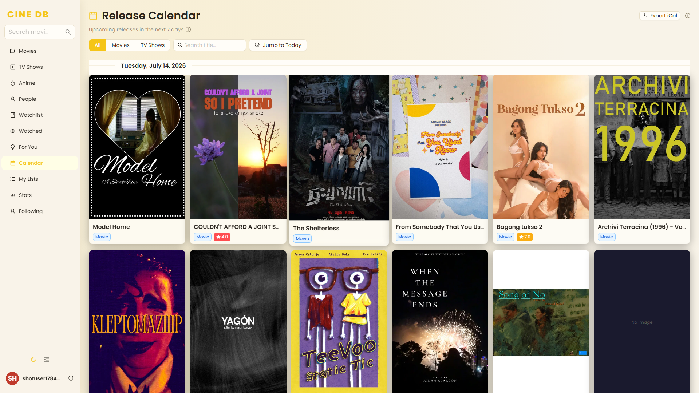
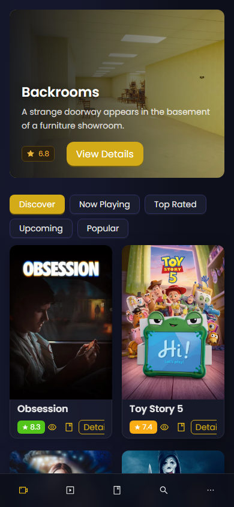
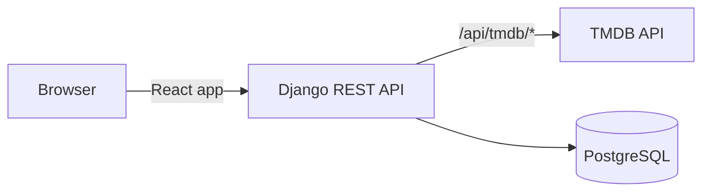

# CINE DB

CINE DB is a full-stack movie and TV tracking app: a React + TypeScript frontend backed by a Django REST API and PostgreSQL, with TMDB as the content source. It covers the full loop a real product needs — JWT auth, a personalized recommendation engine, a stats dashboard, CSV import/export, and a Dockerized production deployment — not just a UI over a public API.

[](https://github.com/SanjayJoshi116/movie-app-v2/actions/workflows/ci.yml)
[](LICENSE)

## Contents

- [Highlights](#highlights)
- [Demo](#demo)
- [Screenshots](#screenshots)
- [Feature Overview](#feature-overview)
- [Features](#features)
- [Tech Stack](#tech-stack)
- [Architecture Overview](#architecture-overview)
- [Quick Start](#quick-start)
- [Environment Variables](#environment-variables)
- [Docker Setup](#docker-setup)
- [Deployment](#deployment)
- [Testing](#testing)
- [API Overview](#api-overview)
- [Roadmap](#roadmap)
- [Contributors](#contributors)
- [License](#license)

---

## Highlights

- **37 REST API endpoints** across health check, TMDB proxy, auth, watchlist/watched, ratings, lists, stats, episode progress, follows, recommendations, notifications, and TMDB OAuth (`## API Overview` below)
- **JWT auth** with silent refresh + rotation/blacklisting, email-based password reset
- **Personalized recommendations** — K-means clustering (scikit-learn) over rating-weighted genre vectors, pre-computed and cached per user
- **Dockerized, 3-service production stack** — nginx + React build, Django/Gunicorn, PostgreSQL (`## Docker Setup`)
- **Responsive, 3-tier layout** — full sidebar (desktop), collapsible icon rail (tablet), bottom nav (phone) — no JS width checks, CSS-only breakpoints
- **234 automated tests** — 28 Jest, 25 Django pytest, 25 Playwright (TS), 156 pytest-playwright — plus `ruff` lint, all run in CI on every push (`## Testing`)

---

## Demo

No live deployment yet — see [Quick Start](#quick-start) to run locally.

---

## Screenshots

### Desktop — Dark

Browse, movie detail, stats dashboard, and release calendar in the default cinema-dark theme.

| Home | Movie Detail | Stats Dashboard | Release Calendar |
|------|-------------|-----------------|-----------------|
|  |  |  |  |

### Desktop — Light

The same four pages in the custom warm-paper light theme.

| Home | Movie Detail | Stats Dashboard | Release Calendar |
|------|-------------|-----------------|-----------------|
|  |  |  |  |

### Mobile



Phone widths (`<768px`) swap the sidebar for a bottom tab bar (`BottomNav`).

---

## Feature Overview

| Area | Summary |
|------|---------|
| Discovery | Browse/search movies, TV, anime, and people; advanced filters, genre tags, infinite scroll |
| Detail Pages | Cast, videos, reviews, recommendations, watch providers, episode guide + progress tracker |
| Library | Watchlist, Watched, ratings/reviews, custom lists, CSV import/export, Stats dashboard, Release Calendar |
| Social | Follow people, personalized/followed-people recommendations, in-app notification bell for new releases from people you follow |
| Auth | JWT login/register, email password reset, profile photo upload |
| UI/UX | Dark/light themes, toasts, skeleton loaders, responsive 3-tier layout, Framer Motion transitions |

## Features

### Discovery
- **Browse & Search** — Discover, Now Playing, Top Rated, Upcoming, and Popular categories for movies, TV shows, and anime; dedicated Search page with live results across movies, TV, and people; the People page also has its own search box
- **Hero Banner** — Trending title of the week as a full-width backdrop with title, overview, rating, and direct link
- **Recent Searches** — Search history dropdown (last 5 queries)
- **Advanced Filters** — Filter by year range, TMDB rating, language, runtime, and sort order; year and release-date sort correctly use `first_air_date` for TV and `primary_release_date` for movies
- **Genre Tags** — Click any genre to filter results
- **Infinite Scroll** — Home, TV, and Anime pages load more as you scroll
- **Recently Watched Strip** — Quick-access thumbnails at the top of Movies and TV pages, filtered by media type

### Detail Pages
- **Movie & TV Detail** — Full info: cast, videos, images, reviews, recommendations, similar titles, watch providers, streaming availability; both pages share the same section order and layout, each showing up to 20 recommendation/similar cards filtered to titles sharing at least half the opened title's genres (falls back to the unfiltered list rather than showing nothing); cast displays in a centered wrapping grid (no horizontal scroll); backdrop images open a full-size lightbox on click
- **Reviews** — TMDB reviews on both Movie and TV detail pages, rendered as a 2-column card grid
- **Add to List** — Shared modal (`AddToListModal.tsx`) with search-existing-lists and inline create-new-list, opened from the detail page or any browse/search/recommendation card — never a dead end even with zero lists yet
- **Mark as Watched** — Opens a confirm modal (`MarkWatchedModal.tsx`) instead of an instant toggle; auto-fetches the title's runtime and streaming platforms from TMDB so you just pick (or type "Other") rather than typing anything — feeds the Stats page's Hours Watched and Platform Breakdown. Un-marking stays a one-click toggle.
- **Episode Guide** — Season/episode breakdown on TV detail pages; collapsed by default, with the episode list for the selected season behind its own toggle
- **Episode Progress Tracker** — Track your current season and episode per show, with +/- controls bounded by the show's actual season and episode counts; edit or delete progress at any time
- **Person Pages** — Actor/crew bios with Movies/TV/Photos tabs (full, uncapped filmography with role/character per credit); info panel includes Known For, Birthday/Deathday, Place of Birth, IMDb, and Website links
- **Follow Actors & Directors** — Follow any person from their detail page or browse/search card; manage followed people at `/following`, including a search/sort bar and a "Recommended From People You Follow" section

### Library
- **Watchlist & Watched** — Save and track movies/TV shows; tied to your account
- **Watchlist & Watched Filters** — Watchlist filters by media type (Movie/TV) and watched status; Watched filters by media type. Both persist search/sort/filter state in `sessionStorage` across navigation and offer a one-click "Clear filters" reset once any filter is active
- **Search, Sort & Export** — Both Watchlist and Watched pages support title search, multiple sort options (newest, title, rating), and one-click CSV export
- **Ratings & Reviews** — Rate anything 1–10 and write personal notes
- **User Lists** — Create, rename, and delete named lists; add or remove any movie or show; each list has its own page (`/lists/:id`) with a search/sort/type-filter bar for its items, scoped CSV import, and export as CSV. The lists grid itself has a search/sort bar and each card shows a poster "theme image" (its first item's poster)
- **CSV Import** — Bulk-import a watched history from any CSV with a TMDB ID column; watched list refreshes immediately after import
- **Stats Dashboard** — Visual overview of your watch history at `/stats`: total counts, movie vs TV split (pie chart), personal rating distribution (bar chart), monthly activity + activity heatmap (side by side), top genres, rating-by-genre, language, and decade breakdowns (bar charts), platform breakdown (bar chart, from what you picked when marking things watched), hours watched, reviews written, lists count, and watchlist backlog size
- **Recommendations** — Personalized suggestions based on your watch history, plus "Because you watched X" sections and recommendations from people you follow (`/recommendations`); search and media-type filter narrow the sections, and each card has inline mark-watched / add-to-watchlist icons so you don't have to open the detail page first. Results are pre-computed at backend startup and served instantly from DB cache. On a cold cache (first-ever request, large watch history) the page polls the API every few seconds and shows a "crunching your watch history" state until results land
- **Release Calendar** — 7-day lookahead of upcoming releases, grouped by date under sticky headers, title search, "Jump to Today", one-click iCal export (`.ics`) for Google Calendar / Apple Calendar (`/calendar`)

### Auth
- **Login / Register** — JWT-based auth; tokens stored in `localStorage`
- **Password Reset** — Email-based: enter your account email, receive a reset link, set a new password via the link
- **Profile Photo** — Upload/remove a JPEG/PNG/WebP avatar (5MB max) from the Edit Profile modal; replaces the initials avatar in the sidebar/bottom nav everywhere

### UI & UX
- **Skeleton Loaders** — Content placeholders while data loads
- **Toast Notifications** — Feedback on watchlist, watched, list, follow, and rating actions
- **Dark / Light Mode** — Cinema-dark (`#0d0f1a`) and light themes; preference saved per account
- **Info Tooltips** — `(i)` tooltips next to non-obvious labels/stats (Stats, Calendar, Lists, Watched, Recommendations, Movie/TV Detail)
- **Password Strength Meter** — Live strength bar under the New Password field when changing your password
- **Unified Typography Scale** — Poppins font throughout; a small `FONT_SIZE` scale (caption/body/emphasis/display) replaces ad-hoc inline sizes
- **Consistent Date Format** — All dates render `dd-mm-yyyy`, independent of the viewer's browser/OS locale
- **Animated UI** — Page transitions and card hover effects via Framer Motion
- **Responsive Layout** — Full sidebar on desktop (≥992px), icon-only collapsed rail on tablet (768–991px), fixed bottom nav with overflow drawer on phones (<768px); the sidebar stays pinned in place while scrolling
- **Manual Sidebar Collapse** — Desktop-only toggle button (fold/unfold icon in the sidebar footer) collapses the 220px sidebar to the same 64px icon rail tablet uses; preference persists in `localStorage` (`cinedb_sidebar_collapsed`)
- **Flash Tooltip** — Clicking a Sidebar or BottomNav icon force-shows its tooltip label for ~1.4s, confirming the destination on layouts where no text label is visible (tablet icon rail, phone bottom nav)

---

## Tech Stack

**Frontend**
- [React 18](https://react.dev/) + [Create React App](https://create-react-app.dev/)
- [TypeScript 5](https://www.typescriptlang.org/) — strict mode
- [React Router v6](https://reactrouter.com/)
- [Ant Design 5](https://ant.design/) + [@ant-design/icons](https://ant.design/components/icon/)
- [Framer Motion](https://www.framer.com/motion/)
- [Recharts](https://recharts.org/) — stats dashboard charts
- [Axios](https://axios-http.com/)

**Backend**
- [Django 4](https://www.djangoproject.com/) + [Django REST Framework](https://www.django-rest-framework.org/)
- [djangorestframework-simplejwt](https://django-rest-framework-simplejwt.readthedocs.io/) — JWT auth
- [scikit-learn](https://scikit-learn.org/) — K-means clustering for recommendations
- [PostgreSQL](https://www.postgresql.org/) + [psycopg2](https://www.psycopg.org/)
- [Ruff](https://docs.astral.sh/ruff/) — Python lint/format, config in `pyproject.toml`

**APIs**
- [TMDB API](https://developer.themoviedb.org/)

---

## Architecture Overview



All frontend requests — both TMDB lookups and app data (watchlist, watched, ratings, lists, stats, auth) — go to Django. A generic passthrough view proxies `/api/tmdb/*` to the real TMDB API; everything else is served directly from PostgreSQL. This keeps the TMDB API key server-side only; the browser never sees it.

```
backend/
├── cinedb/
│   ├── settings.py              # Django settings (PostgreSQL, JWT, CORS, email, throttle rates)
│   └── urls.py                  # Root URL config — mounts /api/
├── userdata/
│   ├── models.py                # WatchlistEntry, WatchedEntry (incl. runtime_minutes, platform),
│   │                            #   RatingEntry, UserList, UserListItem, EpisodeProgress,
│   │                            #   FollowedPerson, UserRecommendationCache (pre-computed rec cache per user),
│   │                            #   TMDBProfile (TMDB OAuth session), Profile (avatar ImageField)
│   ├── serializers.py           # DRF serializers (camelCase field aliases)
│   ├── pagination.py            # DefaultPagination (PageNumberPagination, page_size=100)
│   │                            #   applied to watchlist/watched/ratings/followed-people lists;
│   │                            #   next/previous are plain page numbers, not absolute URLs
│   ├── views.py                 # Thin re-export barrel — import from domain modules below
│   ├── auth_views.py            # register, login, profile, avatar upload/delete, password reset + throttle classes,
│   │                            #   SafeTokenRefreshView (guards against a since-deleted token owner)
│   ├── watchlist_views.py       # watchlist CRUD (paginated list)
│   ├── watched_views.py         # watched CRUD (paginated list) + bulk import
│   ├── ratings_views.py         # ratings CRUD (paginated list) + TMDB mirror
│   ├── lists_views.py           # user lists + list items CRUD (incl. PATCH rename)
│   ├── tmdb_views.py            # TMDB OAuth (request token, session, disconnect)
│   ├── stats_views.py           # stats aggregation + genre cache
│   ├── social_views.py          # episode progress + followed people (paginated list) + recs
│   ├── urls.py                  # /api/ endpoint routing
│   ├── recommendations.py       # K-means genre clustering + followed-people recommendations;
│   │                            #   _compute_for_you / _compute_personalized are standalone fns
│   │                            #   called by views (cache hit) and management command (pre-compute)
│   ├── management/
│   │   └── commands/
│   │       └── compute_recommendations.py  # Management command: pre-computes rec cache for all users;
│   │                                       #   run at container startup via docker-entrypoint.sh
│   ├── tmdb_client.py           # Server-side TMDB API client
│   └── tests/                   # pytest suite: auth, delete-account, password reset, avatar upload,
│                                #   watchlist/watched/ratings pagination, bulk_watched
├── docker-entrypoint.sh         # Prod container entrypoint: migrate --run-syncdb → gunicorn
└── manage.py

src/
├── api/
│   ├── tmdb.ts                  # TMDB API calls — typed, proxied through Django;
│   │                            #   filtersToTMDBParams() accepts mediaType to correctly
│   │                            #   map year/sort params for movies vs TV
│   └── userApi.ts               # Axios instance with Bearer token + auto 401 refresh;
│                                #   exports fetchStats, episode-progress helpers,
│                                #   followed-people helpers, requestPasswordReset,
│                                #   confirmPasswordReset, bulkMarkWatched
├── components/
│   ├── layout/
│   │   └── FilterPanel.tsx      # Advanced filter UI (Ant Design Drawer, right-side)
│   ├── ui/
│   │   └── StarRating.tsx       # Ant Design Rate (1–10, gold, keyboard accessible)
│   ├── watchlist/
│   │   └── RatingModal.tsx      # Modal + Form for rating + review
│   ├── ErrorBoundary.tsx
│   ├── Sidebar.tsx              # Desktop (≥992px): 220px left nav, shows username/sign-out when authed;
│   │                            #   collapses to a 64px icon-only rail on tablet (768-991px, CSS-only via App.css)
│   │                            #   or manually via footer toggle on desktop (persisted, .sidebar-collapsed class)
│   ├── BottomNav.tsx            # Phone (<768px): fixed bottom nav + overflow drawer
│   ├── SearchBox.tsx            # Input.Search with recent-search history dropdown
│   ├── HeroBanner.tsx           # Trending title hero with backdrop and CTA
│   ├── SkeletonCard.tsx         # Skeleton placeholder for media cards
│   ├── PosterPlaceholder.tsx    # Real DOM "No Image" fallback (not an SVG image) so the text
│   │                            #   inherits Poppins; used at every no-poster call site
│   ├── SectionHeader.tsx        # Divider + Title section heading, shared by Movie/TV detail pages
│   ├── WatchProviders.tsx       # Streaming/rent provider logos with deep links, shared by Movie/TV detail pages
│   ├── MediaCardGrid.tsx        # Poster-card grid (Recommendations/Similar/credits), shared by Movie/TV detail
│   │                            #   and Person pages; optional section title and per-item subtitle, limit=20 default
│   ├── ReviewsSection.tsx       # 2-column review cards, shared by Movie/TV detail pages
│   ├── LibraryItemCard.tsx      # Poster + Card.Meta + icon-action card, shared by Watchlist/Watched/Lists pages
│   ├── PersonCard.tsx           # Browse card for People listing + search results + Following page
│   │                            #   (department tag, Follow button); person prop is a minimal structural
│   │                            #   type (id/name/profile_path/known_for_department?), not full TMDBPersonSummary
│   ├── AddToListModal.tsx       # Shared "Add to List" modal (search lists, inline create), used by
│   │                            #   Movie/TV detail pages instead of two separate bare-checkbox modals
│   ├── MarkWatchedModal.tsx     # Shared "Mark as Watched" confirm modal — auto-fetches runtime + streaming
│   │                            #   platforms from TMDB given just mediaId/mediaType; used by every
│   │                            #   watched-toggle icon app-wide (detail pages, browse/search/rec cards)
│   ├── EpisodeGuide.tsx         # Season/episode list for TV detail pages; episode list for the selected
│   │                            #   season sits behind its own collapse toggle
│   ├── CSVUploadModal.tsx       # CSV import modal with preview + TMDB poster enrichment
│   ├── ProfileModal.tsx         # Edit profile, tabbed (Account / Data & TMDB / Danger Zone): avatar upload,
│   │                            #   change password w/ strength meter, delete account (password-confirmed), TMDB OAuth connect
│   ├── PasswordStrengthMeter.tsx # Live strength bar + label under New Password, used by ProfileModal
│   ├── Movie.tsx / Movies.tsx
│   ├── TVShows.tsx / TVShowCard.tsx  # TVShows maps a memoized per-item TVShowCard (mirrors Movie.tsx)
│   ├── MovieDetails.tsx         # Includes add-to-list with checkbox toggle (add + remove)
│   └── TVShowDetails.tsx        # Includes episode progress tracker; add-to-list with toggle
├── context/
│   ├── AppContext.tsx            # Composes UIContext + WatchlistContext + WatchedContext + RatingsContext
│   ├── UIContext.tsx             # theme, search, genre filters
│   ├── WatchlistContext.tsx      # Wraps useWatchlist()
│   ├── WatchedContext.tsx        # Wraps useWatched()
│   ├── RatingsContext.tsx        # Wraps useRatings()
│   ├── AuthContext.tsx           # login, register, logout — persists user in localStorage
│   ├── ListsContext.tsx          # User lists state
│   ├── useAppContext.ts          # Back-compat shim merging the 4 split contexts into the original shape
│   └── useListsContext.ts
├── hooks/
│   ├── useWatchlist.ts          # Async CRUD → /api/watchlist/ (walks pagination via fetchAllPages)
│   ├── useWatched.ts            # Async CRUD → /api/watched/; includes reload() for bulk-import sync
│   ├── useRatings.ts            # Async CRUD → /api/ratings/
│   ├── useLists.ts              # Async CRUD → /api/lists/ (items carry _itemId for DELETE)
│   ├── useEpisodeProgress.ts    # Fetch/update/delete episode progress → /api/episode-progress/
│   ├── useFollowedPeople.ts     # Follow/unfollow actors & directors → /api/followed-people/
│   ├── useInfiniteScroll.ts     # IntersectionObserver for infinite scroll + scroll restoration
│   ├── usePaginatedFetch.ts     # Shared fetch-page-1/loadMore/restore-on-back-nav logic for
│   │                            #   Home/Anime/People pages
│   ├── useToast.ts              # App.useApp() toast wrapper
│   ├── useLocalStorage.ts       # Generic localStorage hook
│   ├── useRecentSearches.ts     # Last 5 searches
│   └── useFlashTooltip.ts       # Force-shows a nav icon's tooltip for ~1.4s after click,
│                                #   used by Sidebar.tsx and BottomNav.tsx
├── pages/
│   ├── HomePage.tsx             # /movies and /tv — HeroBanner, recently watched strip, infinite scroll
│   ├── SearchPage.tsx           # /search — live results across movies, TV, and people
│   ├── AnimePage.tsx            # /anime — filtered TV browse (keyword 210024)
│   ├── MovieDetailPage.tsx      # /movie/:id
│   ├── TVDetailPage.tsx         # /tv/:id
│   ├── PersonPage.tsx           # /person/:id — bio, filmography, follow button
│   ├── PeoplePage.tsx           # /people — popular people browse with infinite scroll + own search box
│   ├── WatchlistPage.tsx        # /watchlist — search, sort, type/watched filters, export CSV (protected)
│   ├── WatchedPage.tsx          # /watched — search, sort, type filter, export CSV (protected)
│   ├── ListsPage.tsx            # /lists — create/delete lists, search/sort, poster theme image per card (protected)
│   ├── ListDetailPage.tsx       # /lists/:id — rename, item search/sort/type filter, scoped CSV import,
│   │                            #   export CSV, clear, delete (protected)
│   ├── StatsPage.tsx            # /stats — watch history charts (protected)
│   ├── FollowingPage.tsx        # /following — manage followed people (protected)
│   ├── CalendarPage.tsx         # /calendar — 60-day release lookahead + iCal export (protected)
│   ├── RecommendationsPage.tsx  # /recommendations — personalized + followed-people recs, search/type filter,
│   │                            #   watch/watchlist toggle icons per card (protected)
│   ├── LoginPage.tsx            # /login
│   ├── RegisterPage.tsx         # /register
│   ├── ForgotPasswordPage.tsx   # /forgot-password — email-based reset link request
│   ├── ResetPasswordPage.tsx    # /reset-password/:uid/:token — set new password from link
│   └── TMDBCallbackPage.tsx     # /tmdb-callback — completes TMDB OAuth session exchange
├── utils/
│   ├── export.ts                # downloadCSV / downloadJSON helpers (Blob + URL.createObjectURL)
│   ├── apiError.ts              # getApiError(error) — normalizes axios/DRF errors to a string
│   ├── fetchAllPages.ts         # Walks a DRF-paginated endpoint's pages and concatenates results
│   │                            #   (falls back to a plain array response transparently)
│   ├── filterByGenreOverlap.ts  # Keeps items sharing >=half a source title's genres; falls back
│   │                            #   to the unfiltered list if that would empty the result — used by
│   │                            #   Movie/TV detail pages' Recommendations and Similar sections
│   └── passwordStrength.ts      # getPasswordStrength() — dependency-free heuristic (length/case/digit/symbol),
│                                #   used by PasswordStrengthMeter.tsx
├── constants/
│   ├── ui.ts                    # pageVariants (Framer Motion), IMG_URL, BACKDROP_URL,
│   │                            #   RATING_GOLD, WATCHED_GREEN — shared across pages
│   ├── genres.ts                # Static TMDB genre list for filter UI
│   ├── providers.ts             # PROVIDER_SEARCH_URLS — TMDB provider_id → deep-link URL builder
│   └── media.ts                 # resolveAvatarUrl() — resolves a user's relative avatar_url against
│                                #   REACT_APP_MEDIA_BASE_URL (empty/same-origin in prod, :8000 in dev)
├── theme/
│   └── antdTheme.ts             # Ant Design ConfigProvider tokens: dark / light
└── types/
    ├── domain.ts                # MediaType, WatchlistEntry, RatingEntry, UserList…
    ├── tmdb.ts                  # All TMDB API response shapes
    ├── context.ts               # AppContextType, ListsContextType
    └── index.ts                 # Barrel re-export
```

**Key design decisions:** the sections above cover structure; the reasoning behind specific choices — auth token handling, pagination quirks, responsive-breakpoint implementation, the recommendation engine's caching strategy, and dozens more — lives in [docs/ARCHITECTURE.md](docs/ARCHITECTURE.md) rather than inline here, to keep this file scannable.

---

## Quick Start

### Prerequisites

- Node.js 18+
- Python 3.10+ (Anaconda recommended)
- PostgreSQL
- A free [TMDB API key](https://developer.themoviedb.org/docs/getting-started)

### Installation

1. Install frontend dependencies:

```bash
npm install
```

2. Install backend dependencies:

```bash
pip install -r backend/requirements.txt
```

3. Set up environment variables — see [Environment Variables](#environment-variables) below.

4. Run Django migrations:

```bash
python backend/manage.py migrate
```

5. (Optional) Pre-compute recommendation cache:

```bash
python backend/manage.py compute_recommendations
```

> This runs automatically at backend startup. Run manually to warm the cache before first use.

6. Start all three servers:

```bash
npm run dev
```

The React app runs at `http://localhost:3000`. The Django API runs at `http://localhost:8000`.

> **Note:** Both must be running for the app to work fully. `npm run dev` starts them together using `concurrently` (and first runs `kill-port 3000 8000` to clear anything left over from a previous run).

### Available Scripts

| Command                     | Description                                           |
| --------------------------- | ----------------------------------------------------- |
| `npm run dev`                | Start React and Django together (recommended, same as `npm start`) |
| `npm start`                 | Same as `npm run dev`                                 |
| `npm run django`            | Start Django API server only                          |
| `npm run build`             | Production build                                      |
| `npm test`                  | Run Jest unit tests                                   |
| `npx playwright test`       | Run E2E tests (starts React dev server automatically) |
| `npx prettier --check src/` | Check formatting (config in `.prettierrc`)            |
| `npx prettier --write src/` | Auto-format all source files                          |
| `ruff check backend/`       | Lint Python backend (config in `pyproject.toml`)      |
| `pytest backend/`           | Run Django backend unit tests (needs `backend/requirements-test.txt`) |

---

## Environment Variables

### `.env` — Frontend (CRA dev server, project root)

Not required for a default local setup — only needed for LAN access (see `### LAN Access` below). CRA reads it directly (`HOST`, `DANGEROUSLY_DISABLE_HOST_CHECK`); nothing server-side lives here anymore.

### `backend/.env` — Django

```
SECRET_KEY=your-django-secret-key
TMDB_API_KEY=your_tmdb_api_key_here
DB_NAME=cinedb
DB_USER=postgres
DB_PASSWORD=your_db_password
DB_HOST=localhost
DB_PORT=5432

# Email password reset (leave blank to use console backend for development)
EMAIL_BACKEND=django.core.mail.backends.smtp.EmailBackend
EMAIL_HOST=smtp.gmail.com
EMAIL_PORT=587
EMAIL_USE_TLS=True
EMAIL_HOST_USER=you@gmail.com
EMAIL_HOST_PASSWORD=your_app_password
DEFAULT_FROM_EMAIL=noreply@cinedb.app

# Must match the port the React app runs on (3000)
FRONTEND_URL=http://localhost:3000

# Production overrides (required when DEBUG=False)
# DEBUG=False
# ALLOWED_HOSTS=yourdomain.com
```

---

## Docker Setup

All three services (frontend, backend, database) run together via Docker Compose.

1. Create `.env.docker` in the project root:

```
POSTGRES_PASSWORD=your_db_password
DB_PASSWORD=your_db_password
DB_NAME=cinedb
DB_USER=postgres
DB_HOST=db
DB_PORT=5432
TMDB_API_KEY=your_tmdb_api_key
SECRET_KEY=your-long-random-django-secret-key
JWT_SIGNING_KEY=your-long-random-jwt-signing-key
DEBUG=False
ALLOWED_HOSTS=*
FRONTEND_URL=http://localhost
EMAIL_BACKEND=django.core.mail.backends.smtp.EmailBackend
EMAIL_HOST=smtp.gmail.com
EMAIL_PORT=587
EMAIL_USE_TLS=True
EMAIL_HOST_USER=you@gmail.com
EMAIL_HOST_PASSWORD=your_app_password
DEFAULT_FROM_EMAIL=CINE DB <you@gmail.com>
```

2. Build and start all services:

```bash
docker compose up --build
```

The app will be available at `http://localhost`.

### LAN Access (same network, different device)

When running via **Docker Desktop** on Windows or Mac, Docker properly forwards ports to the host machine's network interface. Other devices on the same network can access the app using the host machine's LAN IP:

```
http://<host-lan-ip>        # port 80
http://<host-lan-ip>:3000   # port 3000
```

Find the host LAN IP:
- **Windows:** `ipconfig` → look for **IPv4 Address** under Wi-Fi or Ethernet (e.g. `192.168.0.110`)
- **Mac/Linux:** `ifconfig` or `ip addr` → look for `inet 192.168.x.x`

> **Note:** `ALLOWED_HOSTS=*` in `.env.docker` is required for LAN access so Django accepts requests from any IP. This is safe for local network use. For public deployments, restrict to specific domains.

**Service layout:**

| Service    | Image                  | Port            |
| ---------- | ---------------------- | --------------- |
| `frontend` | nginx + React build    | 80 (public)     |
| `backend`  | Python/Django          | 8000 (internal) |
| `db`       | postgres:15-alpine     | 5432 (internal) |

Nginx proxies `/api/*` straight to the `backend` service (which itself proxies TMDB requests, keeping the API key server-side, and serves Django API calls directly) and `/media/*` to `backend` for uploaded avatars. PostgreSQL data persists in the `pgdata` Docker volume; uploaded avatars persist in the `media_data` volume.

---

## Deployment

The Docker Compose setup above is a complete production stack (nginx + React build, Django/Gunicorn, PostgreSQL) — no separate deploy config needed. Any Docker-capable host works: a platform that builds from `docker-compose.yml` directly (Render, Railway, Fly.io), or a plain VPS running `docker compose up --build -d` behind a domain/TLS terminator of your choice.

> **Warning:** `backend/cinedb/settings.py` defaults to `DEBUG=True` and an insecure hardcoded `SECRET_KEY` fallback — safe for local dev, not for a public deployment. Set `DEBUG=False`, a real `SECRET_KEY`, and `ALLOWED_HOSTS` for your domain in `.env.docker` (see [Environment Variables](#environment-variables)) before deploying anywhere public.

---

## Testing

### Unit tests — Jest (28 tests, 4 suites)

Covers core hook and context logic. All hooks are tested with mocked `AuthContext` and `userApi` — no backend required.

```
src/hooks/__tests__/
├── useLocalStorage.test.ts
├── useWatchlist.test.ts
└── useRatings.test.ts

src/context/__tests__/
└── AppContext.test.tsx
```

```bash
npm test
```

### Unit tests — pytest (Django, 25 tests)

Covers register/password-validation, delete-account (password re-confirmation), password-reset-confirm validation, avatar upload/validation/delete, and pagination + `bulk_watched` behavior. Runs against a real Postgres DB (test DB is created/torn down automatically).

```
backend/userdata/tests/
├── test_auth.py       # Register password strength, delete-account confirmation, reset-confirm
├── test_avatar.py     # Upload/delete/replace, content-type + size + corrupt-image validation
├── test_watchlist.py  # Pagination shape + cross-user isolation
├── test_watched.py    # Pagination shape + bulk_watched (dedup, batch cap, transaction)
└── test_ratings.py    # Pagination shape
```

```bash
pip install -r backend/requirements-test.txt
pytest backend/
```

### E2E tests — Playwright (25 tests, 2 projects)

Covers auth flows, movie browsing, search, watchlist operations, and responsive layout behavior. All API calls are mocked via Playwright route interception — no backend required. Runs against both a `chromium` (Desktop Chrome) and `mobile-chrome` (Pixel 5) project. The React dev server starts automatically.

```
e2e/
├── auth.spec.ts        # Login, register, forgot password, redirect guards
├── movies.spec.ts      # Movie/TV browse, category buttons, search, detail navigation
├── watchlist.spec.ts   # Empty state, add/remove, export CSV, watched list
└── responsive.spec.ts  # Sidebar/bottom-nav per breakpoint (phone/tablet/desktop), auth-card
                         #   and bottom-nav no-overflow checks at 320px/340px
```

```bash
npx playwright test
```

### E2E tests — pytest-playwright (156 tests)

Broader-coverage E2E suite in Python, one file per feature area. Same approach as the TS suite — `page.route()` mocks every network call, so only the React dev server (`http://localhost:3000`) needs to be running.

```
e2e/python/
├── conftest.py        # Shared fixtures + mock data (users, tokens, movies, TV shows)
├── test_auth.py       # Login, register, password reset, redirect guards (29)
├── test_browse.py     # Movie/TV browse, categories, filters (13)
├── test_detail.py     # Movie/TV detail pages, cast, recommendations (16)
├── test_lists.py      # User lists CRUD + CSV export (16)
├── test_profile.py    # Profile edit, password change, TMDB connect (11)
├── test_ratings.py    # Rate + review flow (11)
├── test_search.py     # Live search across movies/TV/people (7)
├── test_stats.py      # Stats dashboard charts (18)
├── test_watched.py    # Watched list CRUD, CSV import/export (16)
└── test_watchlist.py  # Watchlist CRUD, sort, export (19)
```

```bash
cd e2e/python
pytest
```

> Requires `pip install -r e2e/python/requirements.txt` and `playwright install --with-deps chromium`.

### CI

GitHub Actions runs the Jest suite, Django `pytest` suite, `ruff check`, and the pytest-playwright E2E suite (`e2e/python/`) automatically on every push and pull request to `main` — see `.github/workflows/ci.yml`. The TypeScript Playwright suite (`e2e/*.spec.ts`) is not yet wired into CI; run it locally with `npx playwright test`.

The `e2e-python` job is capped at `timeout-minutes: 15`, and `e2e/python/pytest.ini` uses pytest-timeout's `thread` method rather than the default `signal` — a hung Playwright call blocks in a background thread that `signal`-mode can't interrupt, which previously let a single stuck test ride GitHub's 6h default job timeout instead of failing cleanly.

---

## API Overview

| Method          | Endpoint                                    | Description                                        |
| --------------- | ------------------------------------------- | -------------------------------------------------- |
| GET             | `/api/health/`                              | Health check (no DB/TMDB calls)                    |
| GET             | `/api/tmdb/<path>`                          | TMDB API passthrough (key stays server-side)       |
| POST            | `/api/auth/register/`                       | Create account                                     |
| POST            | `/api/auth/login/`                          | Login (returns access + refresh tokens)            |
| POST            | `/api/auth/token/refresh/`                  | Refresh access token                               |
| GET/PATCH       | `/api/auth/profile/`                        | Get or update profile (requires auth)              |
| POST/DELETE     | `/api/auth/avatar/`                         | Upload or remove profile photo (requires auth)     |
| DELETE          | `/api/auth/delete-account/`                 | Permanently delete account and all data            |
| POST            | `/api/auth/password-reset/`                 | Request email password reset link                  |
| POST            | `/api/auth/password-reset/confirm/`         | Confirm reset with uid + token + new password      |
| GET/POST        | `/api/watchlist/`                           | List or add watchlist entries                      |
| DELETE/PATCH    | `/api/watchlist/<id>/`                      | Remove or update a watchlist entry                 |
| DELETE          | `/api/watchlist/clear/`                     | Remove all watchlist entries                       |
| GET/POST        | `/api/watched/`                             | List or add watched entries                        |
| DELETE          | `/api/watched/<id>/`                        | Remove a watched entry                             |
| DELETE          | `/api/watched/clear/`                       | Remove all watched entries                         |
| POST            | `/api/watched/bulk/`                        | Bulk-import watched entries (CSV upload)           |
| GET/POST        | `/api/ratings/`                             | List or add/update ratings                         |
| DELETE/PATCH    | `/api/ratings/<id>/`                        | Remove or update a rating                          |
| GET/POST        | `/api/lists/`                               | Create and list user lists                         |
| DELETE/PATCH    | `/api/lists/<id>/`                          | Delete or rename a list                            |
| POST            | `/api/lists/<id>/items/`                    | Add an item to a list                              |
| DELETE          | `/api/lists/<id>/items/clear/`              | Remove all items from a list (keeps the list)      |
| DELETE          | `/api/lists/<id>/items/<item_id>/`          | Remove an item from a list                         |
| GET             | `/api/stats/`                               | Watch history statistics                           |
| GET/POST/PATCH/DELETE | `/api/episode-progress/<show_id>/`    | Get/set/update/delete episode progress             |
| GET/POST        | `/api/followed-people/`                     | List followed people / follow a person             |
| DELETE          | `/api/followed-people/<person_id>/`         | Unfollow a person                                  |
| GET             | `/api/recommendations/for-you/`             | Trending + genre-based recommendations             |
| GET             | `/api/recommendations/personalized/`        | K-means clustered personalized recommendations     |
| GET             | `/api/recommendations/followed-people/`     | Top-rated credits from followed people             |
| GET             | `/api/notifications/new-releases/`          | New releases (last 30 days) from followed people   |
| POST            | `/api/notifications/mark-seen/`             | Mark notifications as read                         |
| GET             | `/api/tmdb-auth/request-token/`             | Start TMDB OAuth flow                              |
| POST            | `/api/tmdb-auth/create-session/`            | Complete TMDB OAuth, store session                 |
| GET             | `/api/tmdb-auth/status/`                    | Check if TMDB account is connected                 |
| DELETE          | `/api/tmdb-auth/disconnect/`                | Disconnect TMDB account                            |

---

## Roadmap

**Considering:**
- [ ] PWA / offline support (Service Workers for poster caching)
- [ ] Regional watch provider switching
- [ ] Per-person or per-list iCal export

---

## Contributors

[](https://github.com/SanjayJoshi116/movie-app-v2/graphs/contributors)

See [`CONTRIBUTING.md`](CONTRIBUTING.md) for dev setup and PR guidelines.

---

## License

MIT © 2026 [SanjayJoshi116](https://github.com/SanjayJoshi116)

See [LICENSE](LICENSE) for the full text.
